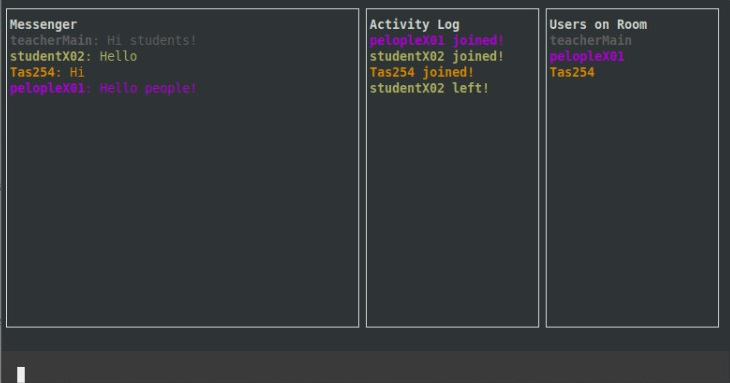

## Project

The project is a messenger that runs in the terminal, works with several people simultaneously and starts as a customized command on your machine.

## Technologies

This project was developed with the following technologies:

- Javascript
- [Node.js](https://nodejs.org/)

## Development

- The project was developed with the pattern builder.
- The interface was built with the Blessed package.
- The native Node.js module was used to issue events.
- ECMAScript Modules has been implemented.
- Web Socket protocol has been implemented.

## How to run

- Clone the repository
- Install dependencies to 'client' with `npm ci --silent`
- Install dependencies to 'server' with `npm ci --silent`
- Start the 'server' with `npm run dev`
- Start the 'client' with `npm run user01` or `npm run user02` or `npm run user03` or `npm run user03`

The 'server' runs on the [`localhost:9898`](http://localhost:9898) link.

## Preview

  

## License

This project is under the MIT license. See the [LICENSE](LICENSE.md) file for more details.